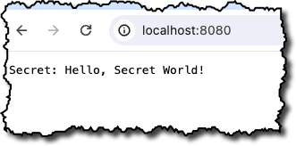

# Populating Volume-Mounted Secrets in Kubernetes from AWS Secrets Manager

## Overview

This project demonstrates the use of volume-mounted secrets in Kubernetes with a Python application and explores an extension for integrating AWS Secrets Manager. This approach combines the security and ease of Kubernetes secret management with the robust features of AWS Secrets Manager, such as automated rotation and enhanced auditing.

## Project Structure

- `app.py`: Python application reading secrets mounted as volumes in Kubernetes.
- `Dockerfile`: Docker image definition for the application.
- `k8s.yaml`: Kubernetes deployment and secret configuration.
- `Tiltfile`: Tilt setup for automated deployment and development.
- `requirements.txt`: Python dependencies for the application.

## Setting Up the Environment

### Local Development Setup

1. **Create a Kubernetes Secret**:
   - Use **kubectl** to create a secret with the required sensitive data.
     - The idea is that this secret will be fetched or published from an external source like AWS Secrets Manager or paramstore, etc. behind the scenes.  No one needs to know what this secret actually is.
   - Example command: `kubectl create secret generic my-secret --from-literal=mykey="YourSecretValue"`

2. **Create and Activate Virtual Environment**:
   - `python -m venv venv`
   - Activate the environment:
     - macOS/Linux: `source venv/bin/activate`
     - Windows: `venv\Scripts\activate`
   
3. **Install Dependencies**:
   - `pip install -r requirements.txt`

### Using Tilt for Development

- Run `tilt up` in your project directory to build and deploy the application.

## Accessing the Application

- The application will be accessible at `http://localhost:8080`, displaying the secret read from the mounted volume.

## Key Concepts

### Kubernetes Volume-Mounted Secrets

- **Secure and Simple**: Secrets are securely stored and easily accessible to the application as files in a volume mount.
- **Isolation and Consistency**: Secrets are isolated per pod and provide a consistent method of accessing sensitive data.

### AWS Secrets Manager Integration

- **Dynamic Secret Retrieval**: Secrets are dynamically fetched and updated from AWS Secrets Manager, providing an automated way to manage sensitive data.
- **Enhanced Security Features**: AWS Secrets Manager offers advanced features like secret rotation, fine-grained access controls, and audit trails.

## Process for Populating Secrets

### 1. Fetching Secrets from AWS Secrets Manager

- Use an automated process, such as a Kubernetes Job or CronJob, to periodically fetch secrets from AWS Secrets Manager.
- This process can be a script or a small application that uses the AWS SDK (e.g., Boto3 for Python) to access AWS Secrets Manager and retrieve the required secrets.

### 2. Updating Kubernetes Secrets

- Once the secrets are fetched from AWS Secrets Manager, the next step is to update the corresponding Kubernetes secrets.
- This can be achieved by a script that runs `kubectl` commands or by using the Kubernetes API directly to update or create secrets in the cluster.

### 3. Mounting Secrets in Pods

- In your Kubernetes deployment configurations (`k8s.yaml`), define volumes that reference the Kubernetes secrets.
- Containers in your pods can then mount these volumes to access the secrets.

## Security Considerations

- **Access Controls**: Ensure that the process or application fetching secrets from AWS has the necessary permissions and follows the principle of least privilege.
- **Secrets Encryption**: Use encryption both in transit and at rest when handling secrets.
- **Audit Logs**: Maintain audit logs for access and changes to the secrets, both in AWS and Kubernetes.

## Using Tilt for Development

- `Tiltfile` remains unchanged for local development purposes. Tilt will continue to automate the deployment process.
- Note: For local development, mock the secret fetching process or directly create Kubernetes secrets as needed.

## Conclusion

Integrating AWS Secrets Manager with Kubernetes volume-mounted secrets provides a robust and dynamic solution for secret management. This setup is ideal for applications requiring automated secret rotation, enhanced security, and the ability to manage secrets across different environments and cloud providers.